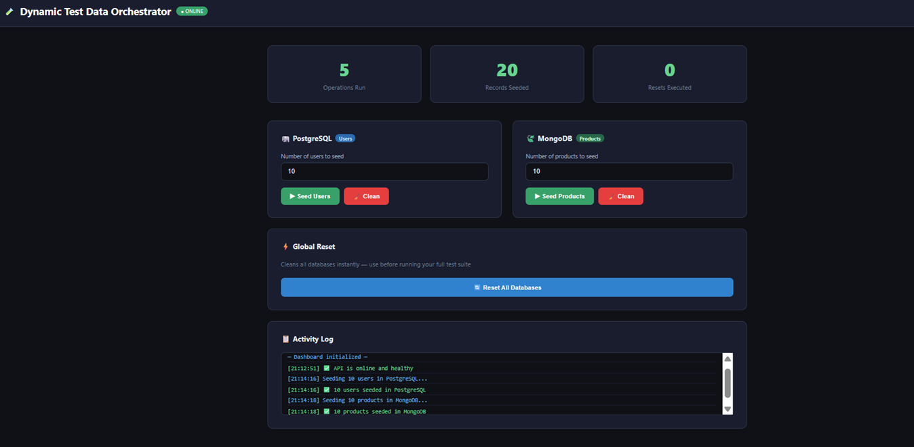

# 🧪 Dynamic Test Data Orchestrator

> Service that dynamically seeds, cleans and prepares databases before each test suite — SQL/NoSQL support, HTTP injection, zero false positives.


---

## 🖥️ Dashboard Preview



---

## 🚩 Problem

One of QA's biggest challenges is **data corruption and inconsistency between test runs**. When tests share state, a failing test can corrupt data for the next one — causing false positives and flaky test suites.

## ✅ Solution

This orchestrator provides a REST API that **cleans, generates and prepares databases dynamically** before each test suite using Data Seeding with Faker.js. Tests become 100% deterministic

---

## 🛠️ Tech Stack

| Technology | Purpose |
|------------|---------|
| Node.js + Express | REST API server |
| Python 3.11 | Alternative seeders |
| PostgreSQL + pg | Relational data seeding |
| MongoDB + Mongoose | NoSQL data seeding |
| Faker.js + Faker (Python) | Realistic fake data generation |
| Docker + Docker Compose | Containerized databases |
| Swagger UI | Interactive API documentation |
| Vitest | API testing |
| GitHub Actions | CI/CD pipeline (Node + Python jobs) |

---

## 🚀 Quick Start

### Prerequisites
- Node.js 20+
- Python 3.11+
- Docker Desktop

### 1. Clone and install
```bash
git clone https://github.com/VladimirRamirez07/dynamic-test-data-orchestrator.git
cd dynamic-test-data-orchestrator
npm install
```

### 2. Start databases
```bash
docker-compose up -d
```

### 3. Configure environment
```bash
cp .env.example .env
```

### 4. Start the API
```bash
node src/api/server.js
```

### 5. Open the dashboard

http://localhost:3000

### 6. Open Swagger docs

http://localhost:3000/docs

---

## 📡 API Endpoints

| Method | Endpoint | Description |
|--------|----------|-------------|
| GET | `/health` | Service health check |
| POST | `/seed/users` | Seed users in PostgreSQL |
| DELETE | `/seed/users` | Clean users table |
| POST | `/seed/products` | Seed products in MongoDB |
| DELETE | `/seed/products` | Clean products collection |
| POST | `/reset` | Reset all databases |

### Example — Seed users before a test suite
```bash
curl -X POST http://localhost:3000/seed/users \
  -H "Content-Type: application/json" \
  -d '{"count": 20}'
```

### Example — Reset everything before running tests
```bash
curl -X POST http://localhost:3000/reset
```

---

## 🐍 Python Seeders

```bash
cd python
pip install -r requirements.txt
python run_all.py
```

---

## 🧪 How it works in a test suite

```javascript
beforeAll(async () => {
  await fetch('http://localhost:3000/reset', { method: 'POST' });
  await fetch('http://localhost:3000/seed/users', {
    method: 'POST',
    body: JSON.stringify({ count: 10 })
  });
});

// Now every test runs with clean, predictable data ✅
```

---

## 📁 Project Structure
```
src/
├── api/
│   ├── server.js            # Express REST API
│   └── dashboard.html       # Visual dashboard UI
├── config/
│   ├── database.js          # PostgreSQL connection
│   └── swagger.js           # Swagger configuration
├── seeders/
│   ├── postgres/
│   │   ├── userSeeder.js    # User seeding logic
│   │   └── run.js           # Standalone runner
│   └── mongo/
│       ├── productSeeder.js # Product seeding logic
│       └── run.js           # Standalone runner
python/
├── config/
│   └── settings.py          # Python environment config
├── seeders/
│   ├── user_seeder.py       # PostgreSQL seeder (Python)
│   └── product_seeder.py    # MongoDB seeder (Python)
├── run_all.py               # Run all Python seeders
└── requirements.txt         # Python dependencies
tests/
└── api.test.js              # Vitest unit tests
docs/
└── dashboard-preview.png    # Dashboard screenshot
.github/
└── workflows/
└── ci.yml               # GitHub Actions (Node + Python)
```
---

## 🤝 Contributing

Pull requests are welcome. For major changes, please open an issue first.

## 📄 License

MIT

